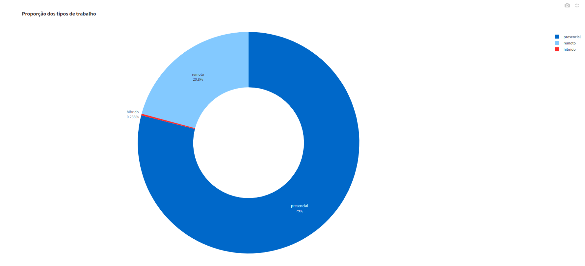
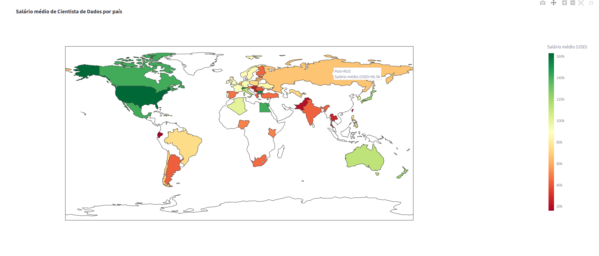

## Data Salary Analytics Dashboard

Interactive Data Analysis with Python & Streamlit

**Dashboard em produção:**  
https://projeto-imersao-dados.streamlit.app/

Dashboard analítico desenvolvido em Python para exploração e visualização de dados salariais do mercado de Dados.  
O projeto transforma um dataset real em insights claros e interativos, permitindo análises comparativas por senioridade, tipo de contrato, modelo de trabalho, tamanho da empresa e localização geográfica.

Projeto desenvolvido durante a Imersão Dados (Alura), com foco em análise de dados, visualização, organização de código e entrega de valor.

---

## Demonstração Visual do Dashboard

### Proporção dos Tipos de Trabalho

Visualização da distribuição entre presencial, remoto e híbrido, permitindo identificar padrões de modelo de trabalho no mercado de dados.



---

### Salário Médio de Cientista de Dados por País

Mapa interativo que evidencia a variação salarial global, facilitando comparações entre diferentes países e regiões.



---

## Objetivo do Projeto

Demonstrar, na prática, competências técnicas e analíticas aplicáveis ao mercado, incluindo:

- Análise exploratória de dados reais  
- Construção de dashboards interativos  
- Comunicação visual de informações complexas  
- Organização e versionamento de projetos  
- Uso de ferramentas amplamente adotadas na área de Dados  

---

## Principais Funcionalidades

- Filtros interativos por:
  - Ano
  - Senioridade
  - Tipo de contrato
  - Modelo de trabalho
  - Tamanho da empresa
- Visualização de:
  - Salário médio
  - Distribuição salarial
  - Comparações entre categorias
- Gráficos interativos e responsivos
- Interface simples, objetiva e orientada à experiência do usuário

---

## Tecnologias e Ferramentas

- Python
- Streamlit
- Pandas
- Plotly
- Git & GitHub

---

## Estrutura do Projeto

```text
projeto-imersao-dados/
│
├── app.py
├── dados_imersao_final.csv
├── requirements.txt
├── assets/
│   ├── README.md
│   ├── proporcao_tipos_trabalho.png
│   └── salario_medio_por_pais.png
└── README.md

---

## Como Executar Localmente

### Pré-requisitos

- Python 3.8 ou superior

### Passo a passo

1. Clone o repositório:

```bash
git clone https://github.com/gabrielgodoiii/projeto-imersao-dados.git
